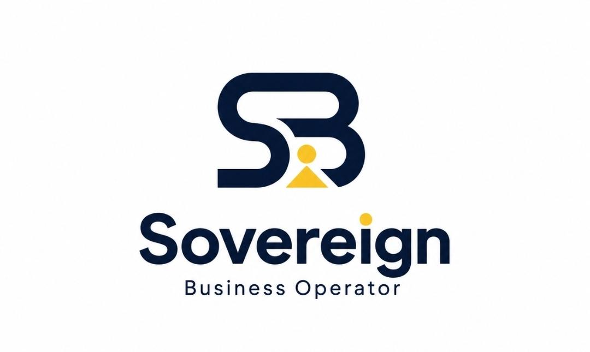
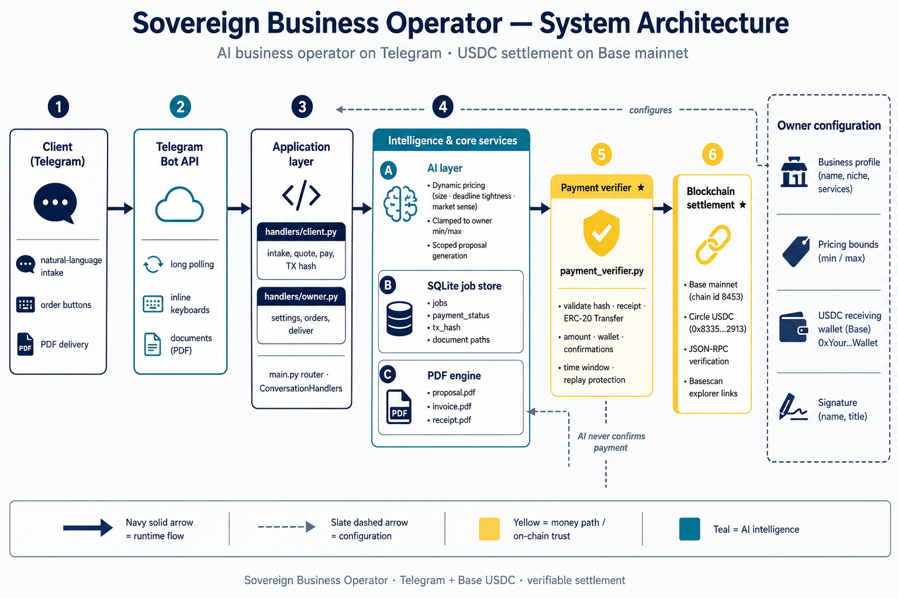

# Sovereign Business Operator

<p align="center">
  
</p>

<p align="center">
  <strong>AI business operator on Telegram</strong><br/>
  Qualify clients · price within owner rules · issue proposals · collect <strong>USDC on Base mainnet</strong> · verify on-chain · deliver receipts & invoices · notify the owner
</p>

<p align="center">
  <a href="https://basescan.org"></a>
  
  
  
  
</p>

<p align="center">
  <a href="https://t.me/sovereign_business_operator_bot"><strong>Live bot</strong></a>
  ·
  <a href="https://sovereignoperator.netlify.app/"><strong>Website</strong></a>
  ·
  <a href="https://youtu.be/fFmWMjToMao"><strong>Demo video</strong></a>
</p>

---

## Table of contents

1. [Overview](#overview)
2. [Problem & solution](#problem--solution)
3. [System architecture](#system-architecture)
4. [Product lifecycle](#product-lifecycle)
5. [Features](#features)
6. [Multi-owner model](#multi-owner-model)
7. [AI layer](#ai-layer)
8. [Payment & verification](#payment--verification)
9. [Documents](#documents)
10. [Tech stack](#tech-stack)
11. [Repository structure](#repository-structure)
12. [Quick start](#quick-start)
13. [Configuration](#configuration)
14. [Owner guide](#owner-guide)
15. [Client guide](#client-guide)
16. [Seeing usage (clients & owners)](#seeing-usage-clients--owners)
17. [Deploy](#deploy)
18. [Security model](#security-model)
19. [Testing checklist](#testing-checklist)
20. [Roadmap](#roadmap)
21. [License](#license)

---

## Overview

**Sovereign** is a Telegram-native **AI agent for service businesses**. It is business-agnostic: the owner configures niche, services, price bounds, USDC wallet, signature, and alert email once. The agent then runs a full commercial loop for that studio.

It is designed for the **Orion Agents** class of product: useful, listable, and trustworthy — AI where judgment helps, deterministic code where money is involved.

| Layer | Responsibility |
|-------|----------------|
| **AI** | Dynamic intake, answer refinement, pricing within bounds, scoped proposals |
| **Workflow** | Conversation state, job lifecycle, owner tools |
| **Settlement** | Base mainnet USDC verification only via `payment_verifier.py` |
| **Documents** | Proposal, receipt, invoice, order export PDFs |

**Production payment network:** Base **mainnet** (chain id `8453`), USDC on Base.  
Documents and chat labels show **Base** / **USDC** — not Base Sepolia.

**Try it**

| Resource | Link |
|----------|------|
| Live Telegram bot | https://t.me/sovereign_business_operator_bot |
| Landing page | https://sovereignoperator.netlify.app/ |
| Product demo (YouTube) | https://youtu.be/fFmWMjToMao |

---

## Problem & solution

| Pain | What teams usually do | What Sovereign does |
|------|------------------------|---------------------|
| Unqualified leads in DMs | Manual Q&A | Structured + dynamic intake |
| Inconsistent quotes | Spreadsheets / gut feel | AI price inside owner min/max |
| “Here’s a screenshot” payment | Trust and hope | On-chain Transfer verification |
| Late invoices | Manual PDF | Auto receipt + invoice after confirm |
| Context switching | Chat + email + chain explorer | One Telegram operator |

---

## System architecture



```text
Client Telegram
  └─ /start {slug} → bind session to business
        │
        ▼
Telegram Bot API
        │
        ▼
main.py + handlers (client / owner)
        │
        ├─ AI (Groq / OpenAI-compatible)
        │ dynamic questions · refine answers · price · proposal
        │
        ├─ SQLite
        │ owners (slug, wallet, email…)
        │ jobs (business_id, payment_*, docs…)
        │
        ├─ PDF engine
        │ proposal · invoice · receipt · order export
        │
        └─ payment_verifier.py ──JSON-RPC──► Base mainnet USDC
                                                    │
                    owner Telegram + Resend email ◄──┘
```

**Hard rule:** the LLM never marks a job paid. Only a successful verifier result does.

**Walkthrough:** [product demo on YouTube](https://youtu.be/fFmWMjToMao) — intake → quote → Base USDC → on-chain verify → receipt & invoice.

---

## Product lifecycle

```text
NEW
  → QUALIFYING (intake)
  → QUOTED (proposal + price)
  → AWAITING_PAYMENT
  → TX_SUBMITTED / VERIFYING
  → PAID (receipt + invoice + owner notify)
  → DELIVERED
  → CLOSED
```

Optional: pause / resume while open.

End-to-end flow is shown in the [demo video](https://youtu.be/fFmWMjToMao).

---

## Features

### Client

- Welcome reflects **that business** (name, niche, services)
- Invite via `/start <slug>` or `https://t.me/<bot>?start=<slug>`
- Dynamic follow-up questions from niche + answers so far
- Messy answers refined for professional PDFs
- AI pricing biased by size, deadline tightness, complexity (clamped to min/max)
- Proposal PDF + payment CTA
- One-tap copyable wallet address
- Paste TX hash → on-chain verify → receipt + invoice PDFs

### Owner

- `/setup` available to any Telegram user (creates **their** business)
- Configure: name, niche, services, min/max price, delivery days, **notify email**
- Payments: Base mainnet USDC receive wallet
- Signature for financial documents
- Orders: view, pause/resume, mark delivered, close, resend receipt/invoice
- Export order PDF (single + batch)
- Send file to client on Telegram
- Client invite slug shown after setup and on owner home
- Paid alerts: Telegram + optional Resend email **to that owner**

### Platform

- Multi-owner isolation (`business_id` on jobs)
- Cross-tenant order access blocked
- Demo fallback: bare `/start` uses env `OWNER_TELEGRAM_ID` business

---

## Multi-owner model

| Concept | v1 implementation |
|---------|-------------------|
| Business key | Owner’s Telegram user id |
| Public invite | `owners.slug` |
| Job ownership | `jobs.business_id` |
| Client session | `context.user_data["owner_id"]` from `/start slug` |
| Isolation | Owner tools only act on own jobs |
| Default demo | `OWNER_TELEGRAM_ID` when no slug |

**Not in v1:** Stripe billing, web admin, multiple businesses per one Telegram account, staff roles.

Manual two-owner test: [`docs/multi_tenant_day4_test.md`](docs/multi_tenant_day4_test.md).

---

## AI layer

| Capability | Behavior |
|------------|----------|
| Intake | First question + dynamic follow-ups |
| Refine | Structure client text for PDFs without inventing services |
| Pricing | Heuristics + optional LLM; always clamped to owner min/max |
| Proposal | Scoped deliverables; template fallback if LLM fails |
| Guardrails | No payment confirmation; no services outside owner config |

Recommended model env (Groq): `openai/gpt-oss-20b`  
(`llama-3.1-8b-instant` was deprecated August 2026.)

---

## Payment & verification

**Module:** `payment_verifier.py` (canonical).

Typical checks:

1. TX hash format  
2. Transaction success  
3. Correct chain (Base mainnet `8453` in production)  
4. ERC-20 Transfer to studio wallet  
5. Configured USDC contract  
6. Amount ≥ quoted  
7. Confirmations  
8. Freshness window  
9. Replay protection (confirmed hash not reused)

Then: job → PAID · receipt + invoice · notify owner (Telegram + email).

**Mainnet = real funds.** Use small demo amounts.

---

## Documents

| Document | When |
|----------|------|
| Proposal PDF | After quote |
| Receipt PDF | After on-chain confirm |
| Invoice PDF | After on-chain confirm |
| Order export PDF | Owner download |

Network label on financial docs: **Base** · Token: **USDC**.

---

## Tech stack

| Layer | Technology |
|-------|------------|
| Runtime | Python 3.11+ |
| Bot | `python-telegram-bot` |
| DB | SQLite (`DATABASE_PATH`; volume on Railway) |
| PDF | ReportLab |
| LLM | OpenAI-compatible HTTP API |
| Chain | Base mainnet · Circle USDC |
| Email | Resend API (SMTP fallback optional) |
| Host | Railway worker (or equivalent) |

---

## Repository structure

```text
sovereign-business-operator/
├── main.py                 # App entry, handlers wiring
├── config.py               # Env configuration
├── db.py                   # SQLite schema, multi-tenant helpers
├── ai.py                   # Intake, pricing, proposal LLM helpers
├── pdf_generator.py        # Proposal, invoice, order export
├── payment_receipt.py      # Receipt PDF
├── payment_verifier.py     # On-chain USDC verification
├── handlers/
│   ├── client.py           # Client intake, pay, documents
│   └── owner.py            # Setup, orders, payments, signature
├── web/
│   ├── index.html          # Landing page
│   └── logo.png
├── docs/
│   ├── architecture.png
│   ├── logo.png
│   └── multi_tenant_day4_test.md
├── Procfile
├── requirements.txt
└── README.md
```

---

## Quick start

```bash
git clone https://github.com/Ebubechukwucyber/sovereign-business-operator.git
cd sovereign-business-operator
python -m venv .venv
# Windows: .venv\Scripts\activate
source .venv/bin/activate
pip install -r requirements.txt
```

Create `.env` from the variables below, then:

```bash
python main.py
```

Public demo (no local setup):

- Bot: https://t.me/sovereign_business_operator_bot  
- Site: https://sovereignoperator.netlify.app/  
- Video: https://youtu.be/fFmWMjToMao  

---

## Configuration

| Variable | Required | Description |
|----------|----------|-------------|
| `TELEGRAM_BOT_TOKEN` | Yes | BotFather token |
| `OWNER_TELEGRAM_ID` | Yes | Default demo owner Telegram id |
| `TELEGRAM_BOT_USERNAME` | Recommended | Bot username without `@` (invite links) |
| `LLM_API_KEY` | Recommended | Groq or compatible key |
| `LLM_BASE_URL` | Recommended | e.g. `https://api.groq.com/openai/v1` |
| `LLM_MODEL` | Recommended | e.g. `openai/gpt-oss-20b` |
| `DATABASE_PATH` | No | Default local file; use `/data/sovereign.db` with volume |
| `BASE_CHAIN_ID` | No | Default `8453` |
| `BASE_RPC_URL` | No | Default `https://mainnet.base.org` |
| `BASE_USDC_CONTRACT` | No | Circle USDC on Base mainnet |
| `RESEND_API_KEY` | Email | Resend secret |
| `EMAIL_FROM` | Email | e.g. `onboarding@resend.dev` |
| `EMAIL_ENABLED` | No | Default on when configured |
| `OWNER_NOTIFY_EMAIL` | Recommended | Fallback paid-order inbox |

---

## Owner guide

1. Open the bot → `/setup`  
2. Business name, niche, services, min/max price, days, **email**  
3. **Payments** → Base mainnet USDC wallet  
4. **Signature** (optional)  
5. Share invite: `/start your-slug` or `https://t.me/<bot>?start=your-slug`  
6. **Orders** → deliver, export, send files  

Live bot: https://t.me/sovereign_business_operator_bot  

---

## Client guide

1. Open invite link or `/start studio-slug`  
2. Start a new project and answer questions  
3. Review proposal PDF and price  
4. Send **USDC on Base** to the shown address (exact amount)  
5. Paste TX hash from Basescan  
6. Receive receipt + invoice after confirmation  

See the flow in the [demo video](https://youtu.be/fFmWMjToMao).

---

## Seeing usage (clients & owners)

There is no public web analytics UI yet. Use:

### Per business (owner)

- Telegram **Orders** list  
- Paid alerts (Telegram + email)  
- Export PDF / batch export  
- **Stats** on the owner menu  

### Platform-wide (operator with DB access)

```sql
SELECT telegram_id, name, slug, setup_complete, created_at
FROM owners ORDER BY created_at DESC;

SELECT id, business_id, client_name, client_username, status,
       payment_status, quoted_price, created_at
FROM jobs ORDER BY id DESC LIMIT 50;

SELECT COUNT(*) FROM owners WHERE setup_complete = 1;
SELECT payment_status, COUNT(*) FROM jobs GROUP BY payment_status;
```

### Recommended next build

- Super-admin command for `OWNER_TELEGRAM_ID` listing all businesses  
- Billing / self-serve SaaS dashboard  

---

## Deploy

**Railway (recommended for the bot):**

1. Connect GitHub repo  
2. Start command: `python main.py` (see `Procfile`)  
3. Set all env vars in the dashboard  
4. Attach a **volume**; set `DATABASE_PATH=/data/sovereign.db`  
5. Ensure only **one** worker polls the bot token  

**Landing page:** host `web/` (Netlify / GitHub Pages / etc.). Set publish directory to `web`.

Current public site: https://sovereignoperator.netlify.app/  

---

## Security model

| Control | Behavior |
|---------|----------|
| Amount | From chain Transfer logs only |
| Recipient | Must match that business’s USDC wallet |
| Token / chain | Configured USDC on Base mainnet |
| Freshness / replay | Time window + confirmed-hash guard |
| AI boundary | Cannot confirm payment |
| Tenancy | Owners cannot access each other’s jobs |
| Secrets | Environment only — never commit keys |

---

## Testing checklist

- [x] `/setup` as owner → slug shown  
- [x] Client `/start slug` → correct business name  
- [x] Proposal + price within min/max  
- [x] Pay USDC on Base → TX verifies  
- [x] Receipt + invoice show **Base** / **USDC**  
- [x] Owner notified on Telegram (+ email if configured)  
- [x] Second owner cannot open first owner’s orders  
- [x] Bare `/start` still loads demo business  

---

## Roadmap

- [x] Intake, dynamic questions, refinement  
- [x] AI pricing + scoped proposals  
- [x] Base mainnet USDC verification  
- [x] Receipt + invoice PDFs  
- [x] Owner tools (export, send file, deliver)  
- [x] Resend email alerts  
- [x] Multi-owner v1 (slug + isolation)  
- [x] Owner stats + super-admin usage view  
- [ ] Billing / self-serve SaaS dashboard  
- [ ] Richer multi-business-per-user  

---

## License

MIT.

---

**Sovereign Business Operator** — AI commercial judgment, deterministic Base USDC settlement, multi-owner ready for real service businesses.

**Links:** [Bot](https://t.me/sovereign_business_operator_bot) · [Website](https://sovereignoperator.netlify.app/) · [Demo](https://youtu.be/fFmWMjToMao)
